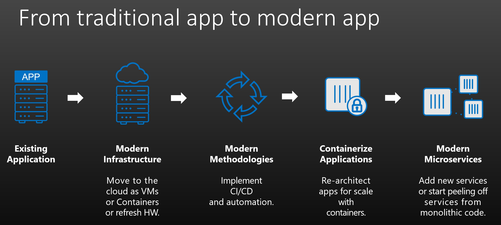

# Migration
Aspects to consider when moving to applications to public cloud.
Modern Approach as well as Traditional Approach
* [Traditional Migration (VMs Workloads)](#traditional-migration-approach)
* [Modern Migration (VM to Containers)](#modern-migration-approach)

## Traditional Migration Approach
There are three stages involved in executing a migration of a multi-tiered application deployed on virtual machines in a privately hosted data centers.
1. [Assessment](#assessment)
2. [Migration Planning](#migration-planning)
3. [Executing the Migration](#execution)

### Assessment
Understand the existing environment being migrated
*   Technical Requirements
*   Business Requirements
*   Roadmap cost based on gathered requirements
    *   Generally a rough figure
    *   Unoptimized implementation (No Cloud feature integration)

General assessment technical deliverables:
*   Inventory Analysis
*   Requirement Definition
*   Cloud-fit Analysis
*   Dependency Mapping
*   Application Mapping
*   Financial Modeling
*   Migration Automation
   
### Migration Planning

### Execution

## Modern Migration Approach

Migration Stages:
1. Assessment
    a. Understand the environment and business needs
    b. Plan requirements and roadmap migration
    c. Identify cost
2. Migration plan 
    a. Setup Migration tool
    b. Setup Destination platform requirements
3. Execute the migration
    a. Test cut-over
    b. CutOver and back

Assessment components:
Inventory Analysis
Requirement Definition
Cloud-fit Analysis
Dependency Mapping
Application Mapping
Financial Modeling
Migration Automation

