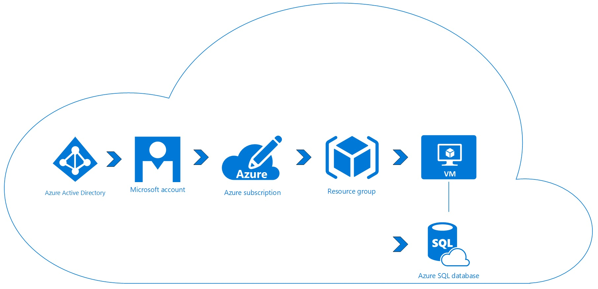

# Purpose
This document illustrates the requested architecture of a Tomcat application backed by a SQL Database.

# Sections
The following topics are going to be discussed:

## [Requirements & Considerations](#requirements-and-considerations)
## [Architecture](#architecture)
## [Cost](#cost)
## [ARM Template](#arm-template)
## [Deployment](#deployment)

# Requirements and Considerations
The requirement and considerations for this deployment are as follows:
*   The OS specified is CentOS for Pilot and RedHat for Production
*   Two Tier Application
    *   Java Application running on Apache Tomcat Server requiring a single VM (4 cores and 16gig memory)
    *   SQL Database (preferably PaaS) but IaaS also would work
        *   Database access required to specific IPs
* Networking Requirements
    * Need to service customers primarily in Singapore
    * Static IP
    * Firewall all except specific IPs
*   No Monitoring mechanism required
    *   On Failure Restart the OS
*   Identity Management within the Application (No Active Directory Requirements)
# Architecture
Resources Utilized - High Level

